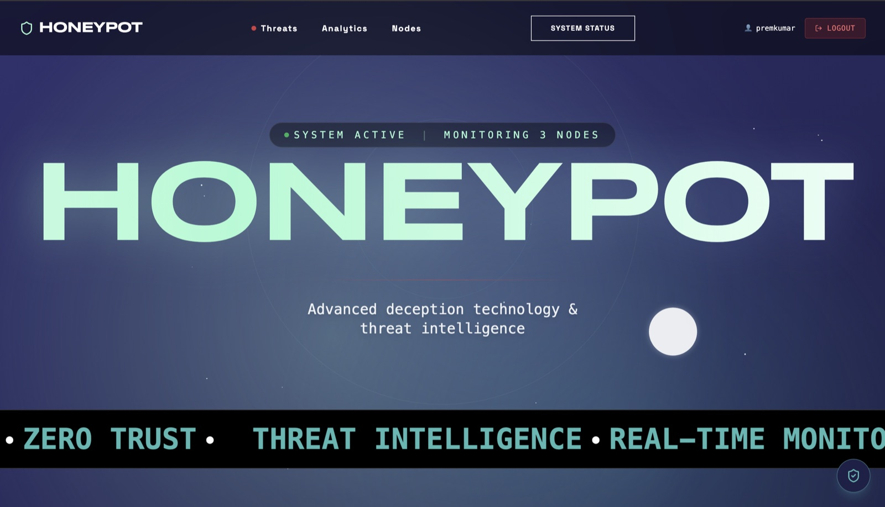
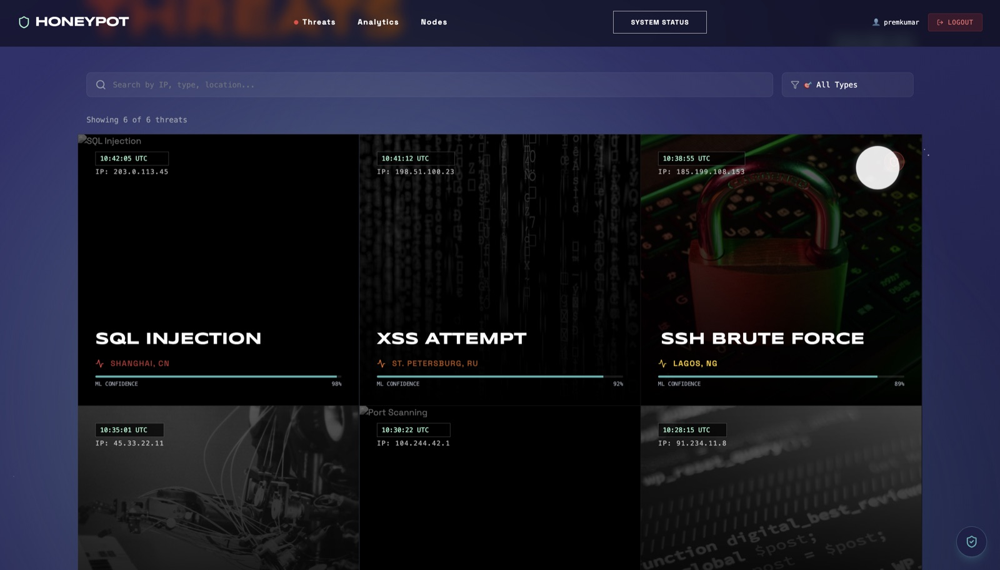
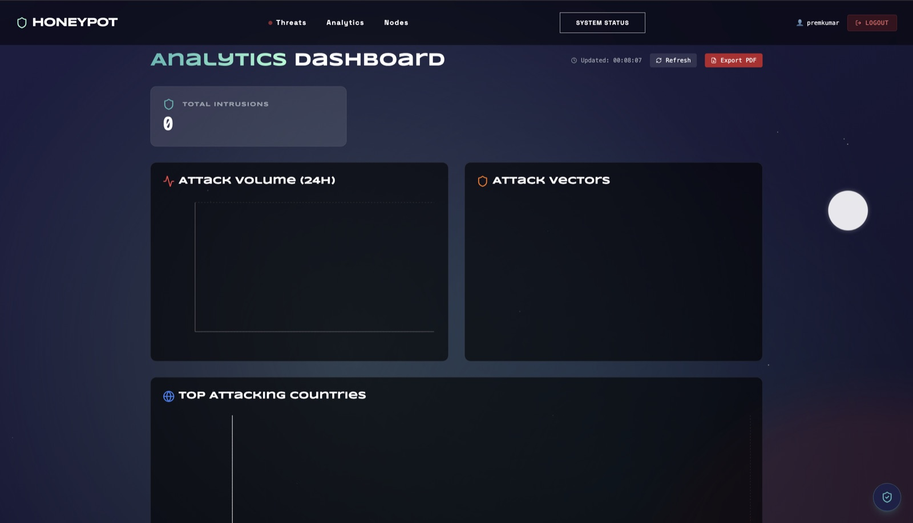
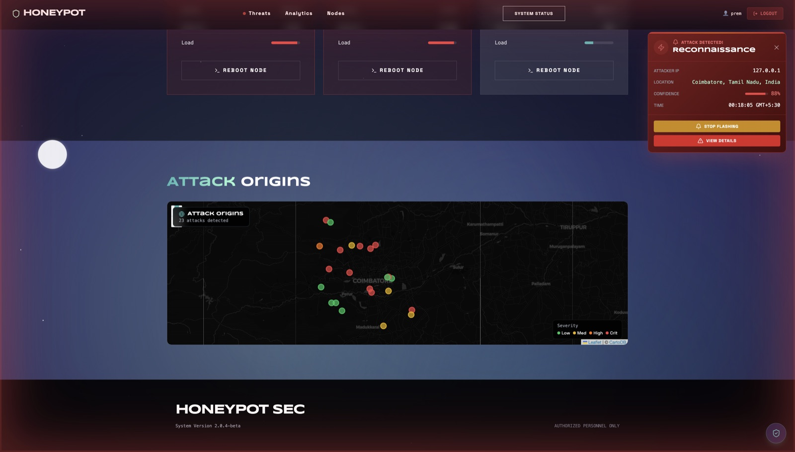
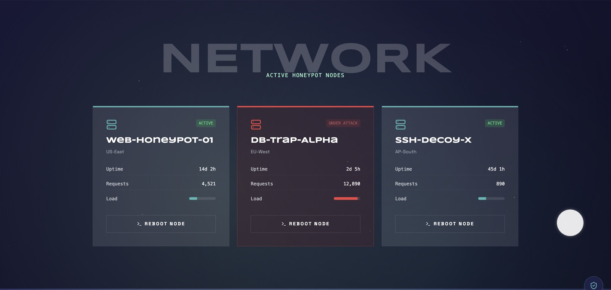
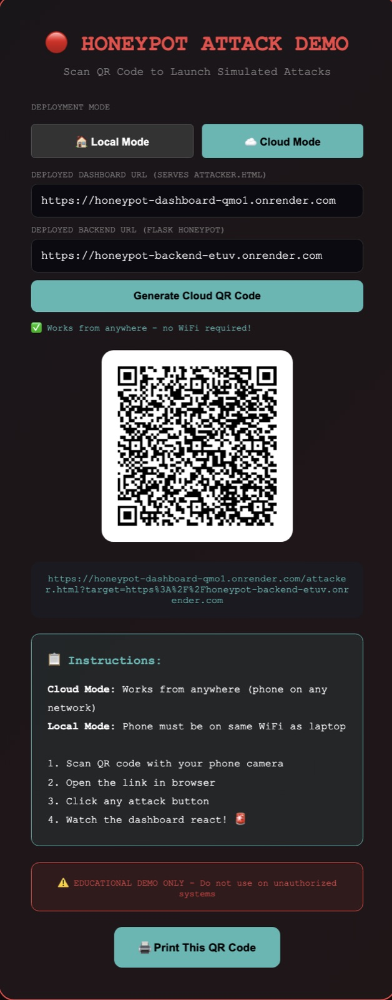

# Honeypot-in-a-Box

A deception-based intrusion detection system. It exposes a set of deliberately
attractive fake endpoints — a login form, an admin panel, a `.env` file, a
database backup — and every request that touches one is captured, classified by
attack type, geolocated, and streamed live to a React dashboard.

Attackers think they found something. What they actually found is a sensor.


**[Live dashboard →](https://honeypot-dashboard-qmo1.onrender.com)**
&nbsp;·&nbsp;
[Backend API →](https://honeypot-backend-etuv.onrender.com)

> Both run on Render's free tier and sleep when idle, so the first request after
> a quiet spell takes ~50 seconds to cold-start. Load the backend link first,
> then the dashboard.



---

## Table of Contents

- [Screenshots](#screenshots)
- [Why this exists](#why-this-exists)
- [Features](#features)
- [Architecture](#architecture)
- [Tech stack](#tech-stack)
- [Attack taxonomy](#attack-taxonomy)
- [The classifier](#the-classifier)
- [Performance](#performance)
- [Project structure](#project-structure)
- [Getting started](#getting-started)
- [Running the live attack demo](#running-the-live-attack-demo)
- [API reference](#api-reference)
- [Deployment](#deployment)
- [Known limitations](#known-limitations)
- [Security notice](#security-notice)
- [License](#license)

---

## Screenshots

**Live threat feed** — every card is a real request that hit a trap endpoint,
labelled with the classified attack type, source IP, location and model
confidence. The panel top-right is the SSE alert, pushed the instant a trap
fires.



**Analytics** — attack volume over 24 hours, distribution by vector, top
attacking countries, a per-IP leaderboard and the severity split. Exports to
PDF. Here across 23 captured attacks spanning five classes.



**Attack origins** — each detection geolocated from its source IP and plotted
by severity: green low through red critical.



**Node control** — per-node status, uptime and request volume, flipping to
`UNDER ATTACK` the moment a trap fires.



**Attack simulator** — generates a QR code pointing a phone at the deployed
honeypot, so the whole pipeline can be demonstrated live from any device with
no tooling installed on it.



---

## Why this exists

Most intrusion detection is *reactive*: you wait for something to go wrong in
production, then dig through logs. A honeypot inverts that. Nothing legitimate
should ever request `/wp-admin` or `GET /.env` on your infrastructure, so every
hit on those paths is, by construction, hostile or at minimum unauthorised
reconnaissance. That gives you a near-zero false-positive signal.

This project builds that idea end to end:

1. **Bait** — Flask serves fifteen trap routes that respond convincingly.
   The fake `/backup` returns a realistic-looking MySQL dump; `/.env` returns
   plausible-looking credentials. Nothing real is exposed.
2. **Capture** — every hit is written to the database with source IP, method,
   endpoint, raw payload, user-agent and timestamp.
3. **Classify** — the payload goes through a TF-IDF + Random Forest classifier,
   fronted and backed by a regex rule engine that covers the categories the
   model was never trained on.
4. **Enrich** — the source IP is resolved to country, city and coordinates via
   MaxMind GeoLite2.
5. **Stream** — the enriched record is pushed to every connected dashboard over
   Server-Sent Events, so the UI reacts in roughly the time it takes the
   attacker's request to complete.

---

## Features

**Detection**
- 15 honeypot trap endpoints covering login, admin, config-file and
  upload-probe attack surfaces
- Three-tier classification: high-precision rules, ML model, regex safety net
- 10 distinct attack categories with critical/high/medium/low severity mapping
- IP geolocation with graceful degradation when the GeoIP database is absent

**Dashboard**
- Live threat feed over SSE, with a 5-second polling fallback for hosts that
  buffer streaming responses
- Interactive world map (Leaflet) plotting attack origins, colour-coded by
  severity
- Analytics: attacks over time, distribution by type and by country, severity
  breakdown, and a top-attacker leaderboard
- Full-text search and per-type filtering across the threat feed
- Audio + visual alerts on new critical detections
- One-click PDF incident report export (ReportLab)
- Optional AI security assistant backed by Google Gemini

**Operations**
- JWT authentication with signup, login, token verification and password change
- Session expiry on 10 minutes of inactivity
- IP blocklist endpoint (in-memory; see [Known limitations](#known-limitations))
- Configurable email-alert thresholds

**Demo tooling**
- QR-code generator that points a phone at your running honeypot
- Mobile-friendly attack simulator with one button per attack class, so you can
  demonstrate the full pipeline live without any tooling on the attacking device

---

## Architecture

```
        ATTACKER                                      DEFENDER
  (phone / curl / scanner)                      (React dashboard)
           │                                            ▲
           │  malicious HTTP request                    │  SSE stream
           ▼                                            │
  ┌────────────────────────────────────────────────────┴──────────┐
  │                    FLASK BACKEND  :5000                        │
  │                                                                │
  │   routes/honeypot.py                                           │
  │     15 trap endpoints ── returns convincing fake responses     │
  │            │                                                   │
  │            ▼                                                   │
  │   models/ml_model.py                                           │
  │     tier 1  high-precision rules (model's blind spots)         │
  │     tier 2  TF-IDF ─► RandomForest  (its 5 trained classes)    │
  │     tier 3  full regex rule set     (safety net)               │
  │            │                                                   │
  │            ▼  label + severity                                 │
  │   utils/geoip.py         models/log_entry.py    utils/sse.py   │
  │     IP → lat/lon    ──►    persist row      ──►  fan-out       │
  └────────────────────────────────────────────────────────────────┘
           │                          │                      │
           ▼                          ▼                      ▼
     GeoLite2-City.mmdb        SQLite / Postgres      connected clients
```

The SSE announcer is an in-process fan-out queue. Every dashboard that opens
`/api/stream` registers a queue; `log_attack()` writes the enriched record to
all of them. This is why the backend runs on a single gunicorn worker with
multiple threads rather than multiple workers — the listener set lives in
process memory.

---

## Tech stack

| Layer | Choice | Why |
|---|---|---|
| Frontend | React 19 + TypeScript + Vite | Fast HMR, typed API surface |
| Styling | Tailwind (PostCSS build) + Framer Motion | Utility CSS compiled ahead of time; JS animation reserved for interaction, keyframes for ambient loops |
| Charts | Recharts | Declarative, composes cleanly with React |
| Map | Leaflet + react-leaflet | Open tiles, no API key needed |
| Backend | Flask 3 + Flask-SQLAlchemy | Small surface, blueprints keep routes separable |
| Database | SQLite (dev) / PostgreSQL (prod) | Zero-config locally, swap via `DATABASE_URL` |
| ML | scikit-learn (TF-IDF + Random Forest) | Strong baseline on short text, interpretable, fast inference |
| GeoIP | MaxMind GeoLite2 | Free, offline, no per-request API cost |
| Realtime | Server-Sent Events | One-way server→client is all this needs; simpler than WebSockets |
| Auth | PyJWT + Werkzeug password hashing | Stateless tokens, no session store |
| Reports | ReportLab | PDF generation without external services |

---

## Attack taxonomy

The system recognises 10 categories. Five are handled by the trained model; the
rest by hand-written rules that run *ahead* of it, for the reason explained
below.

| Category | Severity | Detected by | Example payload |
|---|---|---|---|
| SQL Injection | Critical | Model (tier 2) | `' OR '1'='1` |
| Command Injection | Critical | Model (tier 2) | `; cat /etc/passwd` |
| SSRF | Critical | Model (tier 2) | `http://169.254.169.254/latest/meta-data/` |
| LDAP Injection | Critical | Regex (tier 1) | `*)(uid=*))(\|(uid=*` |
| XSS | High | Model (tier 2) | `<script>alert(1)</script>` |
| Directory Traversal | High | Regex (tier 1) | `../../../../etc/passwd` |
| File Upload Attack | High | Regex (tier 1) | `shell.php` |
| Brute Force | Medium | Regex (tier 1) | `admin` / `password123` |
| Suspicious Activity | Medium | Model default class | unmatched but non-empty |
| Reconnaissance | Low | Heuristic | trap probed with no attack payload |

Classification runs in three tiers, in
[`backend/models/ml_model.py`](backend/models/ml_model.py):

1. **High-precision rules for the model's blind spots.** The training set has
   no label for Directory Traversal, File Upload, LDAP Injection or Brute
   Force, so for those payloads the model can only ever guess wrong — it has no
   class for the right answer. These are matched first.
2. **The model**, for the five categories it was actually trained on.
3. **The full rule set**, as a safety net when the model is missing, fails to
   unpickle, or returns nothing usable.

Tier 1 exists because ordering it the other way round is a silent trap: the
model returns a confident label for *every* input, so putting it first means it
short-circuits the regex layer and the other five categories become
unreachable in practice. Anything promoted to tier 1 has to be high precision,
since it overrides the model — which is why only the unambiguous
credential-stuffing literals are trusted there, and the broad "admin near
password" rule stays in tier 3 where it can't swallow SQL injection submitted
through the same login form.

---

## The classifier

**Pipeline:** `TfidfVectorizer(max_features=5000, ngram_range=(1,2))` →
`RandomForestClassifier(n_estimators=100, random_state=42)`

Attack payloads are short and structurally distinctive — bigrams over tokens
like `UNION SELECT`, `onerror=`, `169.254` carry most of the signal, which is
why a bag-of-ngrams model does well here without anything heavier.

**Dataset:** 499 labelled payloads in
[`backend/data/training_data.csv`](backend/data/training_data.csv), balanced
across five classes (~100 each), derived from the payload corpus in
[`backend/data/WEB_APPLICATION_PAYLOADS.jsonl`](backend/data/WEB_APPLICATION_PAYLOADS.jsonl).

**Measured performance** on a stratified 80/20 split (399 train / 100 test):

```
ACCURACY: 97.00%

5-fold cross-validation: 94.80%  (±9.24%)

                     precision    recall  f1-score   support
  Command Injection       0.95      1.00      0.98        20
      SQL Injection       1.00      1.00      1.00        20
               SSRF       0.91      1.00      0.95        20
Suspicious Activity       1.00      0.95      0.97        20
                XSS       1.00      0.90      0.95        20
           accuracy                           0.97       100
```

The residual errors are two XSS payloads misread as SSRF — both contained
embedded URLs, which is a genuinely ambiguous feature at this dataset size.

Reproduce it yourself:

```bash
cd backend
python scripts/evaluate_model.py
```

Note that this script prints the metrics *and then* retrains on the full
dataset and overwrites `models/classifier.pkl` — that is how the shipped model
was produced. `scripts/train_model.py` is a simpler variant kept for reference;
`scripts/benchmark.py` runs the shipped model against a handful of known
payloads as a smoke test.

---

## Performance

The dashboard is animation-heavy, and the first deployed build scrolled at
10–15fps. Profiling turned up four compounding causes, all of them worth
recording because none were obvious from reading the code:

**Tailwind was loaded from the CDN.** `cdn.tailwindcss.com` ships a JIT
compiler that watches the DOM with a `MutationObserver` and regenerates CSS as
classes appear. Framer Motion rewrites inline styles every frame, so that
observer was recompiling continuously. Tailwind now builds through PostCSS at
compile time.

**Animation ran on the main thread.** Framer Motion drives animation from
JavaScript — it writes inline styles each frame via `requestAnimationFrame`, on
the same thread that handles scrolling. About twenty elements were looping
forever, so scroll and animation competed for that thread the entire time the
page was open. The ambient background, starfield, marquee, radar rings and the
hero gradient are now CSS keyframes, which the compositor runs independently.
The hero mattered most: it animated `background-position`, which is not a
compositable property, so it repainted `14vw` glyph-clipped text every frame.

**Blur and blend modes stacked.** Three background blobs at 80–100vw carried
`filter: blur(40px)` with `mix-blend-screen`, and roughly twenty `backdrop-blur`
panels sat on top of them. Because the background never stopped moving, none of
those panels could ever cache their backdrop. The glow is now radial gradients —
soft by construction, free to paint — and `backdrop-blur` is reserved for the
fixed nav and for overlays that only exist while open.

**Offscreen work was not deferred.** Six Recharts SVGs and a Leaflet map with up
to a hundred markers mounted on first paint despite sitting well below the fold,
so they were laid out and composited during every scroll above them. Both now
mount through an `IntersectionObserver` once scrolled near, behind placeholders
that reserve their height.

Alongside that: threat cards get `content-visibility: auto` so offscreen ones
skip layout entirely, images are lazy and async-decoded, the 5-second poll no
longer replaces the threat array when nothing changed, and the bundle is split
into vendor chunks (950 kB single file → 261 kB entry plus cacheable chunks).
Looping animations respect `prefers-reduced-motion`.

---

## Project structure

```
.
├── App.tsx                     Dashboard shell: feed, search, alerts, routing
├── index.tsx / index.html      Vite entry point
├── index.css                   Tailwind directives + compositor-run keyframes
├── types.ts                    Shared Threat / NodeStatus types
├── vite.config.ts              Dev proxy, env injection, vendor chunking
├── tailwind.config.js          Content globs + font families
│
├── components/
│   ├── AnalyticsDashboard.tsx  Charts, leaderboard, PDF export
│   ├── WorldMap.tsx            Leaflet attack-origin map
│   ├── AuthPage.tsx            Signup / login
│   ├── AIChat.tsx              Gemini-backed security assistant
│   ├── ArtistCard.tsx          Threat card
│   ├── DeferredSection.tsx     Mounts children when scrolled into view
│   └── FluidBackground.tsx · GlitchText.tsx · CustomCursor.tsx
│
├── contexts/AuthContext.tsx    JWT storage, inactivity timeout
├── services/
│   ├── config.ts               Single source of truth for the backend URL
│   ├── api.ts                  REST calls + SSE subscription
│   └── geminiService.ts        Gemini client
│
├── public/
│   ├── attacker.html           Mobile attack simulator (one button per class)
│   └── qrcode.html             QR generator pointing a phone at the simulator
│
└── backend/
    ├── app.py                  App setup, blueprint registration, SSE route
    ├── routes/
    │   ├── honeypot.py         15 trap endpoints + threat/blocklist APIs
    │   ├── dashboard.py        Aggregate stats, map coordinates
    │   ├── auth.py             JWT signup/login/verify/change-password
    │   └── reports.py          PDF export
    ├── models/
    │   ├── log_entry.py        AttackLog SQLAlchemy model
    │   ├── ml_model.py         Three-tier classifier
    │   └── *.pkl               Trained model + vectorizer
    ├── utils/
    │   ├── geoip.py            MaxMind lookup with fallbacks
    │   ├── sse.py              In-process fan-out announcer
    │   └── report_gen.py       ReportLab PDF builder
    ├── scripts/                train / evaluate / benchmark / convert dataset
    └── data/                   Training CSV, payload corpus, GeoIP database
```

`docs/` holds the screenshots above and a standalone HTML write-up of the
project. `render.yaml`, `vercel.json` and `backend/Procfile` are deployment
manifests for Render, Vercel and Railway respectively.

---

## Getting started

**Prerequisites:** Node.js 18+, Python 3.11+

### 1. Clone

```bash
git clone https://github.com/PremKxmar/HoneyPot_Computer_Security.git
cd HoneyPot_Computer_Security
```

### 2. Backend

```bash
cd backend
python -m venv venv
source venv/bin/activate          # Windows: venv\Scripts\activate
pip install -r requirements.txt

cp .env.example .env              # then fill in SECRET_KEY
python -c "import secrets; print(secrets.token_hex(32))"

python app.py                     # http://localhost:5000
```

The database schema is created automatically on first import. Leaving
`DATABASE_URL` blank gives you a local SQLite file at `backend/database.db`.

### 3. GeoIP database (optional)

Attack geolocation needs MaxMind's GeoLite2 City database. It is **not**
committed here because MaxMind's licence forbids redistribution.

1. Create a free account at [MaxMind](https://dev.maxmind.com/geoip/geolite2-free-geolocation-data)
2. Download **GeoLite2 City** in MMDB format
3. Place it at `backend/data/GeoLite2-City.mmdb`

Without it the app still runs — `utils/geoip.py` falls back to a rotating set
of plausible world cities so the map stays populated for demos. Private and
loopback addresses are always mapped to a fixed local coordinate, since they
carry no real geographic information.

### 4. Frontend

```bash
cd ..                             # back to repo root
npm install
cp .env.example .env              # optional: GEMINI_API_KEY for the AI chat
npm run dev                       # http://localhost:3000
```

The Vite dev server proxies `/api`, `/login`, `/admin` and `/backup` to
`127.0.0.1:5000`, so no CORS configuration is needed locally.

### 5. Or start both at once

```bash
./start.sh          # macOS / Linux
start.bat           # Windows
```

Open http://localhost:3000 and create an account — the first signup is your
admin user.

---

## Running the live attack demo

The most convincing way to show this working is to attack it from a phone while
the dashboard is on screen.

1. Find your machine's LAN IP (`ipconfig` on Windows, `ipconfig getifaddr en0`
   on macOS).
2. Open http://localhost:3000/qrcode.html, choose **Local mode**, enter that IP,
   and generate the QR code.
3. Scan it with a phone on the same WiFi. It opens the attack simulator.
4. Tap any attack button.

Within a second or so the dashboard should play its alert, push a new card into
the threat feed, drop a marker on the map, and update the analytics counters.

For a deployed instance, use **Cloud mode** instead and paste your dashboard and
backend URLs — the generated QR embeds the backend as a `?target=` parameter, so
the simulator knows where to aim.

You can also drive it from a terminal:

```bash
curl -X POST http://localhost:5000/login \
     -H 'Content-Type: application/json' \
     -d '{"username": "admin", "password": "1 OR 1=1 UNION SELECT"}'

curl "http://localhost:5000/api/internal/proxy?url=http://169.254.169.254/latest/meta-data/"

curl http://localhost:5000/.env
```

---

## API reference

### Honeypot traps
Every one of these logs the request and returns a deliberately misleading response.

| Method | Endpoint | Bait |
|---|---|---|
| GET · POST | `/login` | Fake login form |
| GET · POST | `/admin`, `/administrator` | Fake admin panel |
| GET | `/wp-admin` | WordPress admin probe |
| GET | `/api/admin` | Unauthorised API surface |
| GET | `/backup`, `/database.sql` | Fake MySQL dump |
| GET | `/.env`, `/config.php` | Fake credentials file |
| POST | `/api/login` | Brute-force target |
| GET · POST | `/api/internal/proxy` | SSRF target |
| GET · POST | `/upload`, `/api/upload` | Malicious upload target |
| GET · POST | `/api/ldap/search`, `/api/directory/lookup` | LDAP injection target |

### Dashboard

| Method | Endpoint | Returns |
|---|---|---|
| GET | `/api/threats?limit=50` | Recent attack log entries |
| GET | `/api/stats` | Totals, per-type, per-country, timeline, severity, leaderboard |
| GET | `/api/attack-locations` | Last 100 attacks with coordinates |
| GET | `/api/stream` | SSE stream of new detections |
| POST | `/api/block-ip` | Add an IP to the blocklist |
| GET | `/api/blocked-ips` | Current blocklist |
| POST | `/api/reports/generate` | PDF incident report |
| GET | `/api/debug/client-ip` | How the caller's IP is being resolved (proxy setup check) |

### Authentication

| Method | Endpoint |
|---|---|
| POST | `/api/auth/signup` |
| POST | `/api/auth/login` |
| GET | `/api/auth/verify` |
| POST | `/api/auth/logout` |
| POST | `/api/auth/change-password` |

### Email alerts

| Method | Endpoint |
|---|---|
| GET · POST | `/api/email-alerts/config` |
| POST | `/api/email-alerts/test` |
| GET | `/api/email-alerts/history` |

---

## Deployment

The frontend and backend deploy as two separate services.

### Render — how the live demo is hosted

Two services. [`render.yaml`](render.yaml) describes both as a Blueprint, though
Blueprints require a payment method on file; creating the services by hand from
the dashboard works on the free tier and takes about five minutes.

**Backend** — New → Web Service, runtime Python 3:

| Setting | Value |
|---|---|
| Root Directory | `backend` |
| Build Command | `pip install -r requirements.txt` |
| Start Command | `gunicorn app:app --bind 0.0.0.0:$PORT --workers 1 --threads 8 --timeout 120` |
| Env | `SECRET_KEY` (generated), `PYTHON_VERSION=3.11.9` |

The root directory has to be `backend`, since the app imports as
`from models.log_entry import db`. Keep `--workers 1`: the SSE listener registry
lives in process memory, so a second worker would strand dashboards connected to
the other one.

**Frontend** — New → Static Site:

| Setting | Value |
|---|---|
| Build Command | `npm ci && npm run build` |
| Publish Directory | `dist` |
| Env | `BACKEND_URL` = the backend's URL, optional `GEMINI_API_KEY` |
| Rewrite | `/*` → `/index.html` |

Set `BACKEND_URL` *before* the first build — Vite bakes it in at build time, so
adding it later needs **Clear build cache & deploy**, not a restart. The rewrite
rule is what keeps `/attacker.html` and page refreshes from 404ing.

> On the free tier both services sleep after ~15 minutes idle, so the first
> request back takes roughly 50 seconds. Worth warming both URLs before a demo.

### Vercel (frontend only)

[`vercel.json`](vercel.json) configures the Vite build and SPA rewrites. Import
the repo, then set `BACKEND_URL` and optionally `GEMINI_API_KEY` as environment
variables. Vercel is serverless and cannot hold a long-lived SSE connection, so
host the Flask backend on Render or Railway and point the frontend at it.

### Railway (backend)

Railway reads [`backend/Procfile`](backend/Procfile) directly. Set the root
directory to `backend`, add a PostgreSQL plugin, and Railway injects
`DATABASE_URL` automatically — `app.py` normalises the legacy `postgres://`
scheme that Railway still emits.

### Environment variables

| Variable | Service | Required | Purpose |
|---|---|---|---|
| `SECRET_KEY` | backend | Yes in production | JWT signing key |
| `PROXY_HOPS` | backend | Yes behind a proxy | Proxies in front of the app; see below |
| `DATABASE_URL` | backend | No | Postgres URL; defaults to local SQLite |
| `MAXMIND_LICENSE_KEY` | backend | No | Enables real geolocation at build time |
| `BACKEND_URL` | frontend | Yes when split-hosted | Backend base URL, baked in at build time |
| `GEMINI_API_KEY` | frontend | No | Enables the AI assistant panel |

### Getting the attacker's real IP

Managed hosts terminate TLS at a proxy and forward to the app over loopback, so
`request.remote_addr` is the *proxy* — every attack lands in the database as
`127.0.0.1` and geolocates to the same point, which quietly kills the map. The
attacker's address is in `X-Forwarded-For` instead.

`app.py` applies Werkzeug's `ProxyFix`, which reads that header counting from
the right. The count has to match the real chain: too low and you log the
outermost proxy, too high and a client can spoof its own address simply by
sending the header itself. Hence `PROXY_HOPS` rather than a hardcoded guess.

Confirm it after deploying:

```bash
curl https://your-backend.onrender.com/api/debug/client-ip
```

`resolved_ip` should equal your public address. If it doesn't, `forwarded_for`
returns the whole chain — count from the right to find your address's position
and set `PROXY_HOPS` to that number.

### Real geolocation

The GeoLite2 database is not committed, so a fresh deployment geolocates to
simulated cities (clearly labelled as such in the UI). For real coordinates,
sign up for a [free MaxMind key](https://www.maxmind.com/en/geolite2/signup),
set `MAXMIND_LICENSE_KEY`, and let the build fetch it:

```
pip install -r requirements.txt && bash scripts/fetch_geoip.sh
```

The script is a no-op without a key, so builds keep working either way.

---

## Known limitations

Being upfront about what this is and isn't:

- **The blocklist is advisory.** `/api/block-ip` stores IPs in a Python set for
  the dashboard to display. It does not touch iptables or a WAF, and it resets
  on restart. Real enforcement would need a firewall integration.
- **Email alerts are simulated.** The configuration and history endpoints work,
  but no SMTP client is wired in yet.
- **Geolocation degrades to simulated cities** unless a MaxMind key is supplied
  at build time, since the licence forbids committing the database. The UI
  labels those results, but the map is decorative until you provide a key.
- **The model covers five of the ten categories.** The other five rely entirely
  on hand-written rules, which generalise to novel payloads far worse than a
  trained classifier would. Labelling those categories and retraining is the
  single highest-value next step.
- **499 training samples is small.** The 9.24% standard deviation across
  cross-validation folds reflects that — the headline accuracy is real, but the
  confidence interval around it is wide.
- **Single-worker constraint.** Horizontal scaling would require moving the SSE
  fan-out to Redis pub/sub.
- **Trap endpoints are unauthenticated by design** — that is the point — but it
  means anyone who finds the deployment can fill the database with noise.

---

## Security notice

This is a research and educational project. A honeypot is a system built to be
attacked, which makes it a liability if you deploy it carelessly.

- Deploy it on isolated infrastructure, never alongside anything real.
- Set `SECRET_KEY` to a generated value before exposing it publicly. The
  hardcoded development fallback is not safe outside localhost.
- The attack simulator in `public/attacker.html` targets whatever URL you give
  it. Only ever point it at your own honeypot. Using it against systems you do
  not own is illegal in most jurisdictions.
- Captured payloads are stored raw. Treat the database as untrusted input if you
  build anything downstream of it.

---

## License

[MIT](LICENSE) © Prem Kumar R

Built as an academic project for Computer Security.
GeoLite2 data © MaxMind, used under its own licence and not redistributed here.
